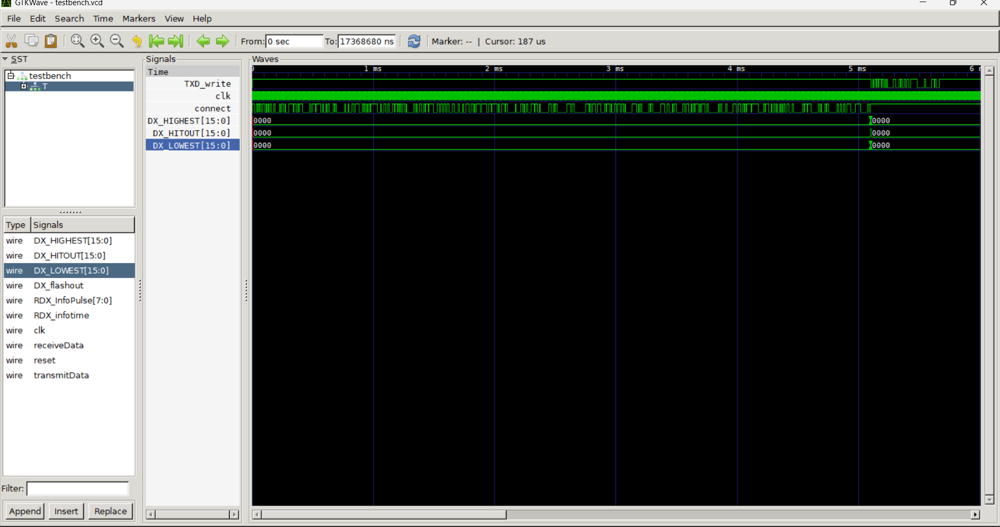

# AGV UART Task Testbench

# Input:

Given Input Stream for the Testbench:
55AA, 21, F668, 0BB8, 94BC, 0428, E28D, F1AB, 3632, 01AD, B74C, DB86, 4418, BDE6, 7DF3, 013B, 230D, 01B2, 0096, 00F6, E73A, A60B, 03ED, 02CA, 79C0, 038B, BA72, 00E4, 03A1, 5E99, 17FC, 2A25, 0062, 01B7, 8045, 3C49, 023E

This is in Big Endian form, we have to convert it into Little Endian

# Output:

Data from Output Stream:

0101010110101010000011100010100101100111111000000010000001101000
this is the data seen as it comes in… I.e. 0 is the first bit, and 1 is the 2nd bit we receive

converting this to HEX we get

55AA0E2967E02068

which will have 3 parts

0E29 —> which when converted to normal hex converts to 290E

67E0 —> which when converted to normal hex converts to E067

2068 —> which when converted to normal hex converts to 6820

Image of the gtkwave file



In this code, we can see what was supposed to be the answer of the smallest and largest angle from the data the processor gives us.


 

this photo shows the entirety of the output we get out from the TXD in TXD_write


# Changes Made:

- We had made an error with how the data was processed. In essence for little endian, the order in which the bits were sent were reversed, even though they should not have been reversed. For instance if we were transmitting ABCD.(1010 1011 1100 1101)
- To make it little endian, it had to be sent as CD AB(1100 1101 1010 1011)
- What we were doing was reverse the entire bit stream. So ABCD would as some WX YZ, where the bit reversal of WX was CD and the bit reversal of YZ was AB.
- So ABCD would be sent as 1011 0011 1101 0101
- During testing with the given testbench data, another issue found was that the input stream was not getting processed in the actual Little Endian format. By changing the direction of the bit shift in the shift register module, this issue was solved for the reciever.

```verilog
// shift.v - Line 15
out <= {stream,out[MSB-1:1]};  // Original Line
out <= {out[MSB-2:0], stream}; // Changed Line
```

- In the `txd` module, we reversed the direction of moving through the data, which also corrected the Little Endian issue in transmission. (the changes in the receiver module reversed order of the `lidar_header` ). The bytes in the individual 2 byte assignments were also reversed

```verilog
// txd.v - Line 46
// Original Code
headout[15:0] <= lidar_header[15:0]; // Set Header to 0x55 0xAA
regout[47:32] <= data[15:0]; // Get _obs(2 bytes)
regout[15:0] <= data[47:32];  // Get min_distance_angle (2 bytes)
regout[31:16] <= data[31:16]; // Get max (2 bytes)

// Changed Code
headout[15:0] <= lidar_header[15:0]; // Set Header to 0x55 0xAA
regout[15:0] <= {data[7:0],data[15:8]}; // Get _obs(2 bytes)
regout[47:32] <= {data[39:32],data[47:40]};  // Get min_distance_angle (2 bytes)
regout[31:16] <= {data[23:16],data[31:24]}; // Get max (2 bytes)

// txd.v - Line 77
// Original Code
else if(count > 0) begin
  transmitData <= regout[0]; //LSB first
  $display(regout[0]);
  regout <= regout >> 1; // shift regout right
  count <= count - 1;
end

// Changed Code
else if(count > 0) begin
  transmitData <= regout[47]; //LSB first
  $display(regout[47]);
  regout <= regout << 1; // shift regout right
  count <= count - 1;
end
```